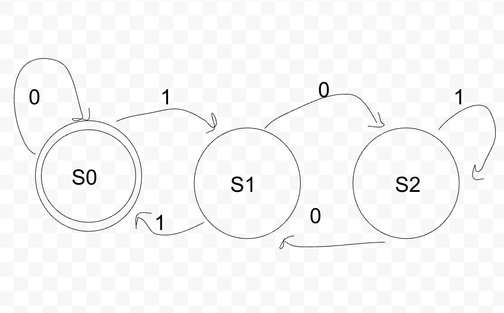
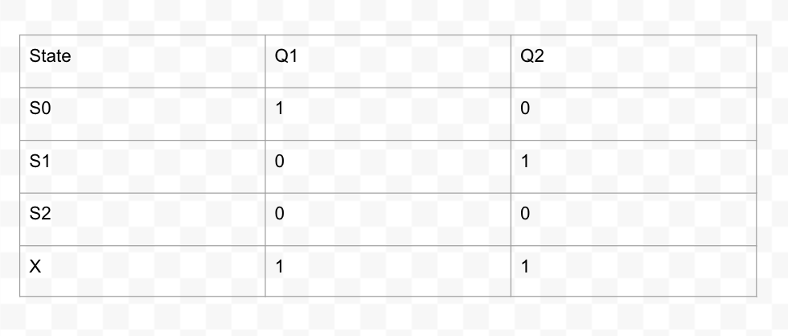
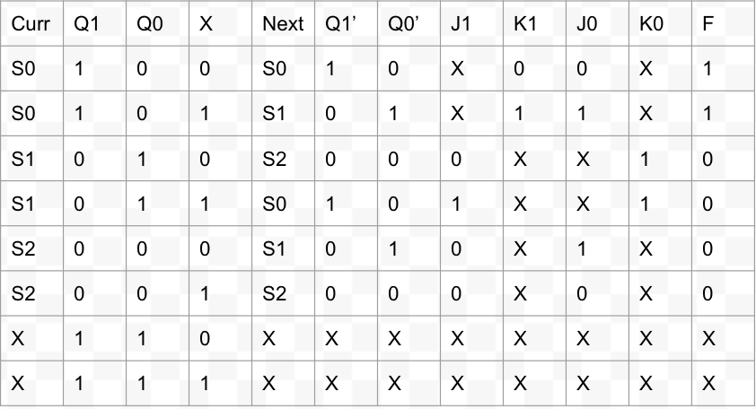
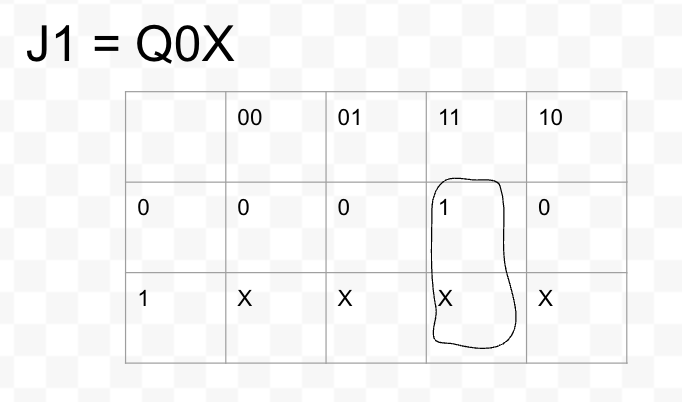
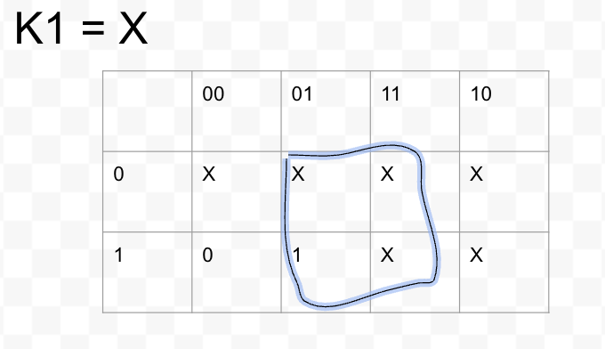
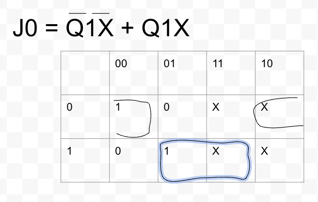
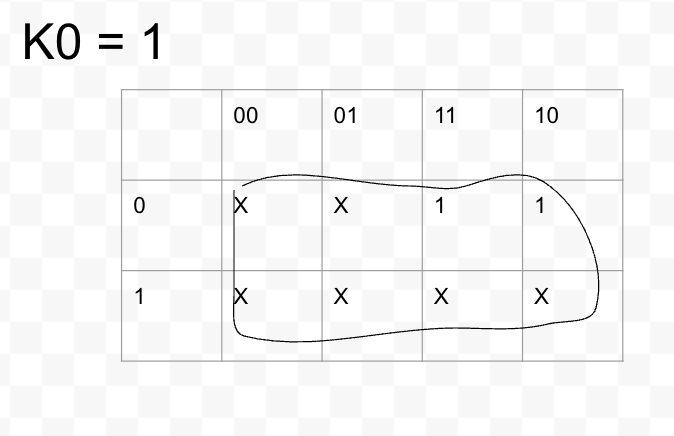
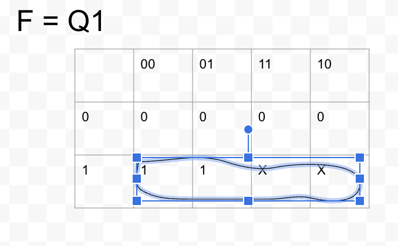

# Lab X: Doing stuff with hardware!

Please write a blog post describing your lab here.

This is just an example of how you might structure your blog post, feel free to edit as you wish. For example, you might divide the lab into different sections each with their own intro, instructions, results, and takeaways. Please see the rubric for details on how the post will be evaluated.

## Overview and Motivation
This week we'll explore...

## Materials

## Project Steps
In order to start designing the circuit, we first needed to design a FSM (DFA-Deterministic Finite Automata), using a state transition diagram. We designed it in the way that if the stream x, ends in 00, then the circuit outputs and 1, and if it ends in anything else, in outputs a 0.

Next we had to contruct a state table.

After we created a state table we need to the FSM to and state table to create a function table. This shows us the before and after values for signals in the circuit. It showa the signals that are sent to the J and K inputs. 

Next, after creating the function table we use the values from the table inorder to contruct k-maps to create our circuit.

Finally, we use the k-maps to design and build the circuit.

## Testing

## Conclusion

